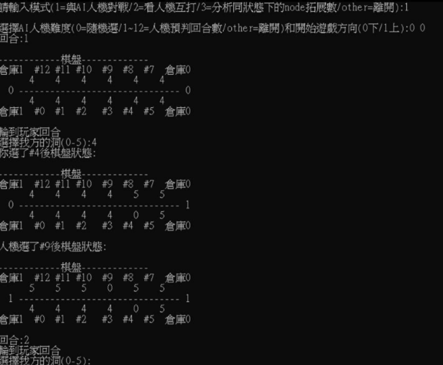
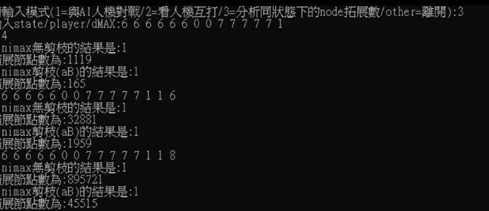

# Kalah-Game
對於經典遊戲”撿金豆”定義狀態空間、狀態轉移函式、目標狀態，最後實作並且提供實力不同的AI模型和玩家進行對戰(也可以看AI對決)。

Details : https://github.com/SUNGOD3/Kalah-Game/blob/main/Kalah-Game.pdf
## How to use?
1. Download and execute "Kalah-Game.exe"
2. 輸入數字來選擇遊玩模式 ('1' = 和AI人機對戰 / '2' = 看兩台AI人機對打 / '3' = 分析node拓展數)，輸入以外數字程式結束
3. 之後按照輸入說明進行遊戲即可

或者可以根據make/makefile,game.h和.o檔自行製作遊戲 (此版本為英文版)

## Preview
 

## Research results
成功使用mini-max 演算法依照搜尋深度來實作不同等級的AI，並且在和隨機遊玩的AI測試中皆獲得了平均9成以上的勝率 (平均勝率也隨著搜尋深度越深而越高)，此外也分析了 Alpha-Beta 剪枝的效果。
